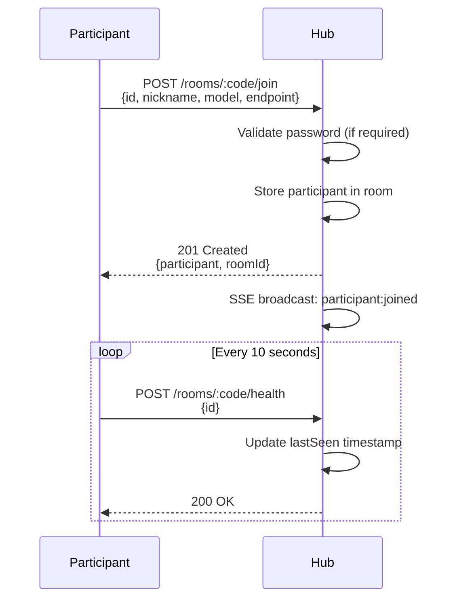
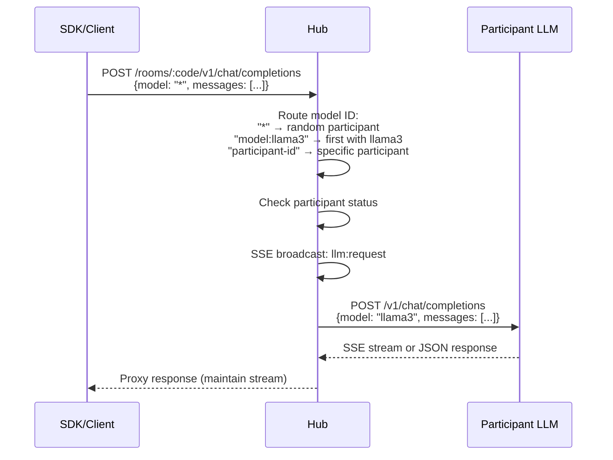
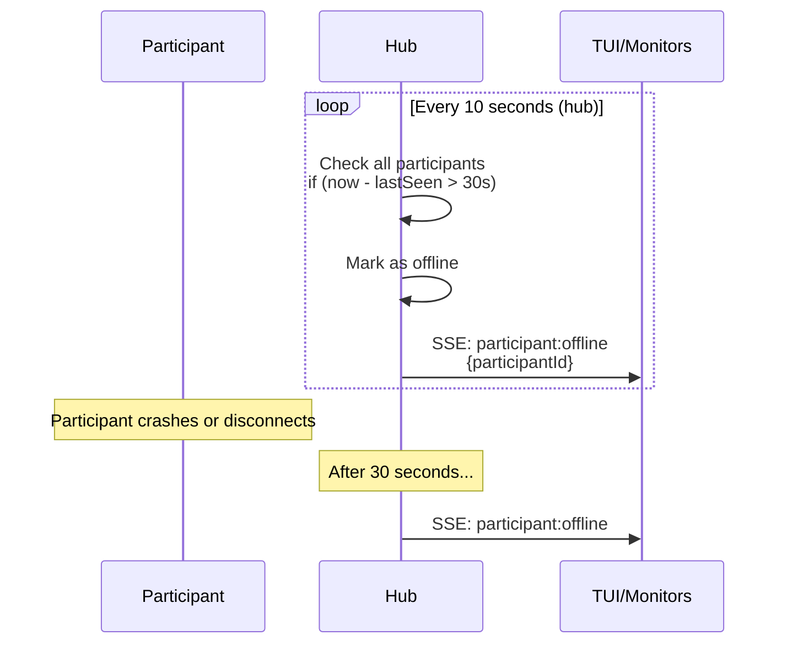

## Overview

Gambiarra uses a **hub-and-spoke architecture** where a central HTTP hub coordinates communication between multiple participants sharing their local LLM endpoints. The system is built on three core principles:

1. **Local-first**: All LLMs run locally on participant machines
2. **Zero-config networking**: Optional mDNS discovery eliminates manual IP configuration
3. **Standard protocols**: HTTP + SSE instead of WebSocket for simpler integration

## Core Components

### Hub (HTTP Server)

The hub is a lightweight HTTP server that acts as a coordinator and proxy:

- **Room management**: Create/list rooms with optional password protection
- **Participant registry**: Track participants and their health status
- **Request routing**: Proxy OpenAI-compatible requests to appropriate participants
- **Event broadcasting**: Send real-time updates via Server-Sent Events (SSE)

**Implementation**: `packages/core/src/hub.ts`

<Info>
The hub stores all state in-memory. Restarting the hub clears all rooms and participants.
</Info>

### Rooms

Rooms are isolated workspaces where participants collaborate:

```typescript
interface RoomInfo {
  id: string;              // Internal UUID
  code: string;            // 6-character public code (e.g., "ABC123")
  name: string;            // Human-readable name
  hostId: string;          // ID of the creator
  createdAt: number;       // Unix timestamp
  passwordHash?: string;   // Optional argon2id hash
}
```

**Key features**:
- **Short codes**: Easy-to-share 6-character room codes
- **Password protection**: Rooms can require passwords (hashed with argon2id)
- **Host tracking**: First participant to create the room becomes the host

**Implementation**: `packages/core/src/room.ts:35-59`

### Participants

Participants are individual machines sharing their LLM endpoints:

```typescript
interface ParticipantInfo {
  id: string;              // Unique identifier
  nickname: string;        // Display name
  model: string;           // Model name (e.g., "llama3")
  endpoint: string;        // OpenAI-compatible API URL
  specs: MachineSpecs;     // Hardware info (GPU, VRAM, etc.)
  config: GenerationConfig; // Default parameters
  status: "online" | "busy" | "offline";
  joinedAt: number;        // When they joined
  lastSeen: number;        // Last health check timestamp
}
```

**Implementation**: `packages/core/src/participant.ts`

### SDK

The SDK provides programmatic access for JavaScript/TypeScript applications:

```typescript
import { createGambiarra } from "gambiarra-sdk";
import { generateText } from "ai";

const gambiarra = createGambiarra({
  hubUrl: "http://localhost:3000",
  roomCode: "ABC123"
});

// Three routing strategies
const result1 = await generateText({ model: gambiarra.any(), prompt: "Hello!" });
const result2 = await generateText({ model: gambiarra.participant("id"), prompt: "Hi!" });
const result3 = await generateText({ model: gambiarra.model("llama3"), prompt: "Hey!" });
```

**Implementation**: `packages/sdk/src/provider.ts`

### CLI

The CLI offers scripting and automation capabilities:

```bash
# Start a hub
gambiarra serve --port 3000 --mdns

# Create a room
gambiarra create "My Room" --password secret123

# Join a room
gambiarra join ABC123 --nickname "Alice" --model "llama3"

# List rooms
gambiarra list
```

**Implementation**: `packages/cli/src/cli.ts`

### TUI (Terminal UI)

The TUI provides interactive monitoring and management:

- Real-time participant status via SSE
- Room creation and joining
- Visual health indicators
- Event log viewer

**Implementation**: `apps/tui/src/index.tsx`

## Communication Architecture

### HTTP + SSE Model

Gambiarra replaced WebSocket with **HTTP for requests** and **SSE for events**:

```
┌─────────────────────────────────────────────────────────────┐
│                    GAMBIARRA HUB                            │
│                                                             │
│  HTTP Endpoints:                                            │
│  ┌──────────────────────────────────────────────────────┐  │
│  │ POST   /rooms                    Create room         │  │
│  │ GET    /rooms                    List rooms          │  │
│  │ POST   /rooms/:code/join         Register participant│  │
│  │ DELETE /rooms/:code/leave/:id    Participant leaves  │  │
│  │ POST   /rooms/:code/health       Health check (10s)  │  │
│  │ GET    /rooms/:code/participants List participants   │  │
│  │ POST   /rooms/:code/v1/chat/completions  Proxy LLM  │  │
│  │ GET    /rooms/:code/v1/models    List models         │  │
│  │ GET    /rooms/:code/events       SSE event stream    │  │
│  └──────────────────────────────────────────────────────┘  │
│                                                             │
│  In-Memory State:                                           │
│  ┌──────────────────────────────────────────────────────┐  │
│  │ rooms: Map<id, RoomState>                           │  │
│  │ codeToRoomId: Map<code, id>                         │  │
│  │ participants: Map<id, ParticipantInfo>              │  │
│  └──────────────────────────────────────────────────────┘  │
└─────────────────────────────────────────────────────────────┘
       ▲              ▲                ▲
       │ HTTP         │ HTTP           │ SSE
       │              │                │
  ┌────┴────┐    ┌────┴─────┐    ┌────┴─────┐
  │   SDK   │    │   CLI    │    │   TUI    │
  └─────────┘    └──────────┘    └──────────┘
```

**Why HTTP + SSE instead of WebSocket?**

1. **Simpler SDK integration**: Uses standard `@ai-sdk/openai-compatible` provider
2. **Better debugging**: HTTP requests are easy to inspect with curl/Postman
3. **Standard API**: Any OpenAI-compatible client works out of the box
4. **Unidirectional events**: Hub broadcasts events; clients don't need to send events back

**Reference**: See `docs/old/architecture-v1-websocket.md` for the previous WebSocket design

## Data Flow

### 1. Participant Registration



**Implementation**: `packages/core/src/hub.ts:68-115`

### 2. LLM Request Routing



**Implementation**: `packages/core/src/hub.ts:249-306`

### 3. Health Monitoring



**Constants**:
- `HEALTH_CHECK_INTERVAL = 10_000` ms (10 seconds)
- `PARTICIPANT_TIMEOUT = 30_000` ms (3 missed checks)

**Implementation**: `packages/core/src/hub.ts:380-388`

## SSE Event Types

The hub broadcasts these events to connected SSE clients:

| Event | Data | Description |
|-------|------|-------------|
| `connected` | `{clientId}` | Client successfully connected |
| `room:created` | `{room}` | New room was created |
| `participant:joined` | `{participant}` | Participant joined a room |
| `participant:left` | `{participantId}` | Participant left a room |
| `participant:offline` | `{participantId}` | Participant timed out |
| `llm:request` | `{participantId, model}` | LLM request routed to participant |
| `llm:error` | `{participantId, error}` | LLM request failed |

**Implementation**: `packages/core/src/sse.ts`

## Package Structure

Gambiarra is a Bun + Turbo monorepo:

```
packages/
  core/           # Hub server, room management, types
    src/
      hub.ts       # HTTP server and routing
      room.ts      # Room and participant state
      participant.ts # Participant creation
      sse.ts       # Server-Sent Events
      mdns.ts      # mDNS/Bonjour discovery
      types.ts     # Zod schemas and types
  
  cli/            # Command-line interface
    src/
      cli.ts       # Main CLI entry point
      commands/    # Command implementations
  
  sdk/            # JavaScript/TypeScript SDK
    src/
      provider.ts  # AI SDK provider
      client.ts    # HTTP client
      rooms.ts     # Room management
      participants.ts # Participant management

apps/
  tui/            # Terminal user interface
  docs/           # Documentation site
```

## Design Principles

### 1. Feature Parity

All three interfaces (SDK, CLI, TUI) provide the same core capabilities:

| Feature | SDK | CLI | TUI |
|---------|-----|-----|-----|
| Create room | ✅ API | ✅ `create` | ✅ Dialog |
| Join room | ✅ API | ✅ `join` | ✅ Dialog |
| List rooms | ✅ API | ✅ `list` | ✅ Selector |
| Chat completion | ✅ AI SDK | ✅ Via SDK | ❌ (monitor only) |
| Real-time events | ✅ SSE API | ❌ | ✅ Built-in |
| Serve hub | ❌ | ✅ `serve` | ✅ Embedded |

### 2. OpenAI Compatibility

The hub exposes OpenAI-compatible endpoints, making it a drop-in replacement:

```typescript
// Works with any OpenAI client
import OpenAI from "openai";

const client = new OpenAI({
  baseURL: "http://localhost:3000/rooms/ABC123/v1",
  apiKey: "not-needed"
});

const response = await client.chat.completions.create({
  model: "*",  // Gambiarra routing
  messages: [{ role: "user", content: "Hello!" }]
});
```

### 3. Stateless Hub

The hub maintains no persistent storage:

- All state is in-memory
- Restarting clears rooms and participants
- Participants must re-join after hub restart
- Suitable for development and local networks

<Warning>
In production scenarios, consider implementing persistent storage or state synchronization.
</Warning>

## Next Steps

<CardGroup cols={2}>
  <Card title="Model Routing" icon="route" href="/guides/model-routing">
    Learn how to route requests to specific participants or models
  </Card>
  <Card title="Room Management" icon="door-open" href="/guides/room-management">
    Master room lifecycle, passwords, and participant health checks
  </Card>
  <Card title="mDNS Discovery" icon="broadcast-tower" href="/guides/mdns-discovery">
    Enable zero-config networking with Bonjour/Zeroconf
  </Card>
  <Card title="API Reference" icon="code" href="/api/overview">
    Explore all HTTP endpoints and SDK methods
  </Card>
</CardGroup>