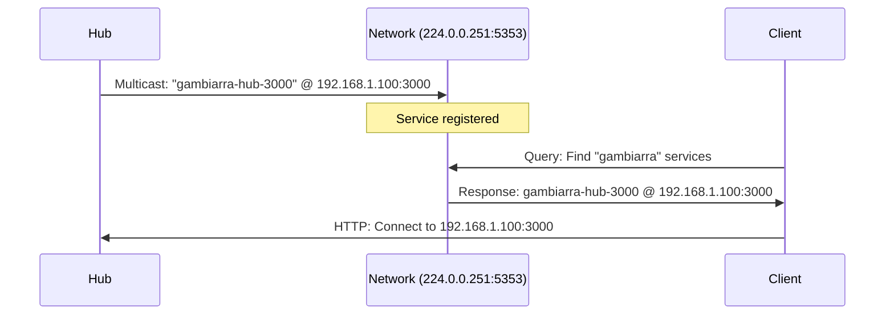

## Overview

**mDNS** (multicast DNS) is a protocol for zero-configuration service discovery on local networks. Gambiarra uses mDNS to automatically publish and discover hub servers without requiring manual IP address configuration.

When enabled, participants can find hubs on the network by name instead of IP address:

```bash
# Without mDNS - need to know IP address
gambiarra join ABC123 --hub http://192.168.1.100:3000

# With mDNS - automatic discovery
gambiarra join ABC123  # Finds hub automatically
```

## What is mDNS?

### Technical Overview

mDNS (also known as **Bonjour** on Apple devices or **Zeroconf** on Linux) enables:

- **Service discovery**: Find services by type (e.g., "find all Gambiarra hubs")
- **Name resolution**: Resolve `.local` hostnames to IP addresses
- **No infrastructure**: Works without DNS servers or DHCP configuration
- **Local network only**: Broadcasts are limited to the local subnet

### How It Works

1. **Service announcement**: Hub broadcasts its availability via multicast
2. **Service browsing**: Clients listen for service announcements
3. **Resolution**: Client resolves service name to IP:port
4. **Connection**: Client connects via resolved endpoint



<Info>
mDNS uses IP multicast address `224.0.0.251` and UDP port `5353`.
</Info>

## Enabling mDNS

### Starting Hub with mDNS

**Using CLI**:

```bash
# Enable mDNS with --mdns flag
gambiarra serve --port 3000 --mdns
```

**Using SDK**:

```typescript
import { hub } from "gambiarra-sdk";

const myHub = await hub.create({
  port: 3000,
  mdns: true  // Enable mDNS
});

console.log(`Hub published as: ${myHub.mdnsName}`);
// Output: Hub published as: gambiarra-hub-3000
```

**Using Core API**:

```typescript
import { createHub } from "@gambiarra/core/hub";

const myHub = createHub({
  port: 3000,
  hostname: "0.0.0.0",
  mdns: true
});

console.log(`mDNS name: ${myHub.mdnsName}`);
```

**Implementation**: `packages/core/src/hub.ts:363-377`

### Service Name Format

Gambiarra publishes services with this naming convention:

```
gambiarra-hub-{port}._gambiarra._tcp.local
```

Examples:
- Port 3000: `gambiarra-hub-3000._gambiarra._tcp.local`
- Port 8080: `gambiarra-hub-8080._gambiarra._tcp.local`

### Published Metadata

Each service includes TXT records with metadata:

```typescript
mDNS.publish({
  name: `gambiarra-hub-${port}`,
  port,
  txt: {
    version: "1.0",
    protocol: "http"
  }
});
```

**Implementation**: `packages/core/src/hub.ts:372-376`

## Discovering Hubs

### Using the Browse API

```typescript
import { mDNS } from "@gambiarra/core/mdns";

// Start browsing for Gambiarra services
const stopBrowsing = mDNS.browse((service) => {
  console.log(`Found hub: ${service.name}`);
  console.log(`  Port: ${service.port}`);
  console.log(`  Version: ${service.txt.version}`);
  console.log(`  Protocol: ${service.txt.protocol}`);
});

// Stop browsing when done
stopBrowsing();
```

**Example output**:
```
Found hub: gambiarra-hub-3000
  Port: 3000
  Version: 1.0
  Protocol: http
```

**Implementation**: `packages/core/src/mdns.ts:92-108`

### Service Discovery Example

Complete example of discovering and connecting to a hub:

```typescript
import { mDNS } from "@gambiarra/core/mdns";

function discoverHub(): Promise<string> {
  return new Promise((resolve, reject) => {
    const timeout = setTimeout(() => {
      stopBrowsing();
      reject(new Error("No hub found within 5 seconds"));
    }, 5000);

    const stopBrowsing = mDNS.browse((service) => {
      clearTimeout(timeout);
      stopBrowsing();
      
      // Resolve to hub URL
      const hubUrl = `http://localhost:${service.port}`;
      resolve(hubUrl);
    });
  });
}

// Use it
const hubUrl = await discoverHub();
console.log(`Connecting to ${hubUrl}`);
```

## Implementation Details

### Publishing Services

Gambiarra uses the `bonjour-service` library for mDNS:

```typescript
import Bonjour from "bonjour-service";

const instance = new Bonjour();

const service = instance.publish({
  name: "gambiarra-hub-3000",
  type: "gambiarra",
  port: 3000,
  txt: { version: "1.0", protocol: "http" }
});
```

**Implementation**: `packages/core/src/mdns.ts:38-51`

### Unpublishing Services

When the hub closes, it unpublishes its service:

```typescript
export function unpublish(name: string): boolean {
  const service = publishedServices.get(name);
  if (service) {
    if (service.stop) {
      service.stop();
    }
    publishedServices.delete(name);
    return true;
  }
  return false;
}
```

**Implementation**: `packages/core/src/mdns.ts:56-66`

### Cleanup on Hub Close

```typescript
close: () => {
  clearInterval(healthInterval);
  if (mdnsName) {
    mDNS.unpublish(mdnsName);  // Stop broadcasting
  }
  Room.clear();
  SSE.closeAll();
  server.stop();
}
```

**Implementation**: `packages/core/src/hub.ts:435-443`

## Network Requirements

### Firewall Configuration

mDNS requires these ports to be open:

| Protocol | Port | Direction | Purpose |
|----------|------|-----------|----------|
| UDP | 5353 | Inbound/Outbound | mDNS queries and responses |
| TCP | 3000* | Inbound | Hub HTTP server |

*Or whatever port you configure

### Platform-Specific Notes

**macOS**:
- mDNS is built-in (Bonjour)
- Usually works out of the box
- Check firewall: System Settings → Network → Firewall

**Linux**:
- Requires Avahi daemon: `sudo apt install avahi-daemon`
- Start service: `sudo systemctl start avahi-daemon`
- Check status: `sudo systemctl status avahi-daemon`

**Windows**:
- Requires Bonjour service (installed with iTunes or Bonjour Print Services)
- Or use third-party mDNS responder
- May need firewall exception for UDP 5353

<Note>
mDNS only works on the **local network**. It won't discover hubs across VPNs or different subnets.
</Note>

## Troubleshooting

### Hub Not Discovered

**Problem**: Client can't find hub via mDNS

**Solutions**:

1. **Check if mDNS is enabled**:
   ```bash
   # Verify hub started with --mdns flag
   gambiarra serve --mdns
   ```

2. **Verify service is published**:
   ```bash
   # macOS/Linux: Use dns-sd
   dns-sd -B _gambiarra._tcp local.
   
   # Or avahi-browse on Linux
   avahi-browse -rt _gambiarra._tcp
   ```

3. **Check firewall**:
   ```bash
   # Linux: Check UDP 5353
   sudo ufw allow 5353/udp
   
   # macOS: System Settings → Network → Firewall
   # Allow incoming connections for "gambiarra"
   ```

4. **Verify Avahi is running** (Linux):
   ```bash
   sudo systemctl status avahi-daemon
   sudo systemctl restart avahi-daemon
   ```

### Multiple Hubs on Same Port

**Problem**: Two hubs running on the same port create naming conflicts

**Solution**: Use different ports or unique names:

```typescript
// Hub 1
const hub1 = createHub({ port: 3000, mdns: true });
// Published as: gambiarra-hub-3000

// Hub 2 - use different port
const hub2 = createHub({ port: 3001, mdns: true });
// Published as: gambiarra-hub-3001
```

### Service Not Unpublishing

**Problem**: Old services remain after hub stops

**Solution**: Ensure proper cleanup:

```typescript
const myHub = createHub({ port: 3000, mdns: true });

// Always close the hub when done
process.on("SIGINT", () => {
  myHub.close();  // This unpublishes mDNS
  process.exit(0);
});
```

### Different Subnet

**Problem**: Hub and client are on different subnets (e.g., WiFi vs Ethernet)

**Solution**: mDNS doesn't cross subnet boundaries. Options:

1. **Move to same subnet**: Connect both to same network
2. **Use manual IP**: Specify hub URL explicitly
3. **Configure mDNS reflector**: Advanced networking setup

```bash
# Fallback to manual IP when mDNS fails
gambiarra join ABC123 --hub http://192.168.1.100:3000
```

### Docker Networking

**Problem**: mDNS doesn't work in Docker containers

**Solution**: Use host networking mode:

```bash
# Run hub with host network
docker run --network host gambiarra-hub
```

Or expose mDNS port:

```yaml
# docker-compose.yml
services:
  hub:
    image: gambiarra-hub
    ports:
      - "3000:3000"
      - "5353:5353/udp"  # mDNS
```

<Warning>
Docker bridge networking isolates mDNS multicast. Use `--network host` or manual IP addresses.
</Warning>

## Testing mDNS

### Command-Line Tools

**macOS/Linux** (`dns-sd`):

```bash
# Browse for Gambiarra services
dns-sd -B _gambiarra._tcp local.

# Resolve a specific service
dns-sd -L gambiarra-hub-3000 _gambiarra._tcp local.
```

**Linux** (`avahi-browse`):

```bash
# Browse all services
avahi-browse -a

# Browse Gambiarra services
avahi-browse -rt _gambiarra._tcp
```

**Windows** (Bonjour Browser):

- Download Bonjour Browser from Apple or third-party
- Look for `_gambiarra._tcp` services

### Programmatic Testing

```typescript
import { mDNS } from "@gambiarra/core/mdns";

// Test publishing
const service = mDNS.publish({
  name: "test-hub",
  port: 9999,
  txt: { test: "true" }
});

console.log("Published test-hub on port 9999");

// Test browsing
const stopBrowsing = mDNS.browse((service) => {
  if (service.name === "test-hub") {
    console.log("✅ Found test-hub!");
    console.log(service);
    stopBrowsing();
  }
});

// Cleanup after 5 seconds
setTimeout(() => {
  mDNS.unpublish("test-hub");
  console.log("Unpublished test-hub");
}, 5000);
```

## Advanced Usage

### Custom Service Types

Publish services with custom types:

```typescript
import { mDNS } from "@gambiarra/core/mdns";

mDNS.publish({
  name: "my-custom-service",
  type: "myapp",  // Custom type
  port: 8080,
  txt: {
    version: "2.0",
    features: "chat,rooms"
  }
});

// Browse for custom type
const stopBrowsing = mDNS.browse({
  type: "myapp"
}, (service) => {
  console.log("Found myapp service:", service);
});
```

### Multiple Hub Discovery

Discover and connect to multiple hubs:

```typescript
import { mDNS } from "@gambiarra/core/mdns";

const discoveredHubs = [];

const stopBrowsing = mDNS.browse((service) => {
  discoveredHubs.push({
    name: service.name,
    url: `http://localhost:${service.port}`,
    metadata: service.txt
  });
});

// Wait 3 seconds to discover all hubs
await new Promise(resolve => setTimeout(resolve, 3000));
stopBrowsing();

console.log(`Found ${discoveredHubs.length} hubs:`);
discoveredHubs.forEach(hub => {
  console.log(`  ${hub.name}: ${hub.url}`);
});
```

### Health Monitoring

Combine mDNS with health checks:

```typescript
import { mDNS } from "@gambiarra/core/mdns";

async function findHealthyHub(): Promise<string> {
  return new Promise((resolve, reject) => {
    const stopBrowsing = mDNS.browse(async (service) => {
      const hubUrl = `http://localhost:${service.port}`;
      
      try {
        // Check if hub is healthy
        const response = await fetch(`${hubUrl}/health`);
        if (response.ok) {
          stopBrowsing();
          resolve(hubUrl);
        }
      } catch (error) {
        console.warn(`Hub ${service.name} not responding`);
      }
    });
    
    setTimeout(() => {
      stopBrowsing();
      reject(new Error("No healthy hub found"));
    }, 5000);
  });
}
```

## Security Considerations

### mDNS Exposure

<Warning>
mDNS announces services to the **entire local network**. Anyone on the network can discover your hub.
</Warning>

**Mitigations**:

1. **Use password-protected rooms**:
   ```bash
   gambiarra create "My Room" --password secret123
   ```

2. **Run on trusted networks only**

3. **Disable mDNS in production**:
   ```bash
   gambiarra serve --port 3000  # No --mdns flag
   ```

4. **Use VPN or firewall rules**

### Privacy Concerns

mDNS broadcasts reveal:
- Service names (e.g., `gambiarra-hub-3000`)
- Port numbers
- TXT record metadata (version, protocol)
- Device hostname

<Tip>
For sensitive deployments, use manual IP configuration instead of mDNS.
</Tip>

## Reference

### mDNS API

```typescript
import { mDNS } from "@gambiarra/core/mdns";

// Publish a service
const service = mDNS.publish({
  name: string,
  port: number,
  type?: string,  // default: "gambiarra"
  txt?: Record<string, string>
});

// Unpublish a service
mDNS.unpublish(name: string): boolean

// Browse for services
const stopBrowsing = mDNS.browse(
  callback: (service: DiscoveredService) => void
): () => void

// Cleanup all services
mDNS.destroy(): void
```

**Implementation**: `packages/core/src/mdns.ts`

### DiscoveredService Type

```typescript
interface DiscoveredService {
  name: string;                    // Service name
  port: number;                    // Port number
  txt: Record<string, string>;     // TXT records
}
```

## Next Steps

<CardGroup cols={2}>
  <Card title="Architecture" icon="diagram-project" href="/guides/architecture">
    Understand the overall system design
  </Card>
  <Card title="Room Management" icon="door-open" href="/guides/room-management">
    Learn how to manage rooms and participants
  </Card>
</CardGroup>