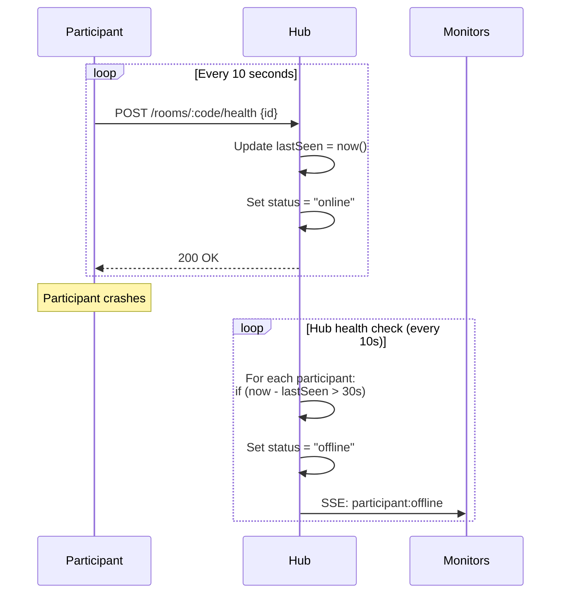

## Overview

Rooms are isolated workspaces where participants share their LLM endpoints. Each room has:

- A **6-character code** for easy sharing (e.g., `ABC123`)
- An **internal UUID** for server-side tracking
- Optional **password protection** with argon2id hashing
- A **host ID** tracking who created the room
- A collection of **participants** with health monitoring

## Creating Rooms

### Using SDK

```typescript
import { rooms } from "gambiarra-sdk";

const room = await rooms.create({
  hubUrl: "http://localhost:3000",
  name: "My AI Room"
});

console.log(`Room created: ${room.code}`);
console.log(`Host ID: ${room.hostId}`);
```

**With password protection**:

```typescript
const room = await rooms.create({
  hubUrl: "http://localhost:3000",
  name: "Private Room",
  password: "secret123"
});
```

### Using CLI

```bash
# Create a public room
gambiarra create "My AI Room"

# Create a password-protected room
gambiarra create "Private Room" --password secret123
```

### Using HTTP

```bash
curl -X POST http://localhost:3000/rooms \
  -H "Content-Type: application/json" \
  -d '{
    "name": "My AI Room",
    "password": "secret123"
  }'
```

**Response**:

```json
{
  "room": {
    "id": "ckl123abc...",
    "code": "ABC123",
    "name": "My AI Room",
    "hostId": "host-uuid",
    "createdAt": 1234567890000
  },
  "hostId": "host-uuid"
}
```

<Note>
The `passwordHash` field is never returned in API responses to prevent offline brute-force attacks.
</Note>

**Implementation**: `packages/core/src/hub.ts:47-62`

## Listing Rooms

### Using SDK

```typescript
import { rooms } from "gambiarra-sdk";

const allRooms = await rooms.list({
  hubUrl: "http://localhost:3000"
});

allRooms.forEach(room => {
  console.log(`${room.code}: ${room.name} (${room.participantCount} participants)`);
});
```

### Using CLI

```bash
gambiarra list
```

### Using HTTP

```bash
curl http://localhost:3000/rooms
```

**Response**:

```json
{
  "rooms": [
    {
      "id": "ckl123abc...",
      "code": "ABC123",
      "name": "My AI Room",
      "hostId": "host-uuid",
      "createdAt": 1234567890000,
      "participantCount": 3
    }
  ]
}
```

**Implementation**: `packages/core/src/hub.ts:64-66`

## Joining Rooms

### Using SDK

```typescript
import { participants } from "gambiarra-sdk";

const participant = await participants.join({
  hubUrl: "http://localhost:3000",
  roomCode: "ABC123",
  nickname: "Alice",
  model: "llama3",
  endpoint: "http://localhost:11434",  // Ollama endpoint
  password: "secret123"  // If room is protected
});

console.log(`Joined as ${participant.id}`);
```

**With specs and config**:

```typescript
const participant = await participants.join({
  hubUrl: "http://localhost:3000",
  roomCode: "ABC123",
  nickname: "Bob",
  model: "gpt-4",
  endpoint: "http://localhost:1234",  // LM Studio
  specs: {
    gpu: "NVIDIA RTX 4090",
    vram: 24,
    ram: 64,
    cpu: "AMD Ryzen 9 7950X"
  },
  config: {
    temperature: 0.7,
    max_tokens: 2000
  }
});
```

### Using CLI

```bash
# Join a public room
gambiarra join ABC123 \
  --nickname "Alice" \
  --model "llama3" \
  --endpoint "http://localhost:11434"

# Join a protected room
gambiarra join ABC123 \
  --nickname "Bob" \
  --model "gpt-4" \
  --endpoint "http://localhost:1234" \
  --password "secret123"
```

### Using HTTP

```bash
curl -X POST http://localhost:3000/rooms/ABC123/join \
  -H "Content-Type: application/json" \
  -d '{
    "id": "custom-id",
    "nickname": "Alice",
    "model": "llama3",
    "endpoint": "http://192.168.1.50:11434",
    "password": "secret123",
    "specs": {
      "gpu": "NVIDIA RTX 4090",
      "vram": 24
    },
    "config": {
      "temperature": 0.7
    }
  }'
```

**Response**:

```json
{
  "participant": {
    "id": "custom-id",
    "nickname": "Alice",
    "model": "llama3",
    "endpoint": "http://192.168.1.50:11434",
    "specs": { "gpu": "NVIDIA RTX 4090", "vram": 24 },
    "config": { "temperature": 0.7 },
    "status": "online",
    "joinedAt": 1234567890000,
    "lastSeen": 1234567890000
  },
  "roomId": "ckl123abc..."
}
```

**Implementation**: `packages/core/src/hub.ts:68-115`

<Warning>
Joining fails with `401 Unauthorized` if the password is incorrect or missing for protected rooms.
</Warning>

## Password Protection

### How It Works

Gambiarra uses **argon2id** (via Bun's native password API) for secure password hashing:

```typescript
// Creating a room with password
const passwordHash = await Bun.password.hash("secret123");
// Stores: $argon2id$v=19$m=65536,t=2,p=1$...

// Validating on join
const isValid = await Bun.password.verify("secret123", passwordHash);
```

**Implementation**: `packages/core/src/room.ts:10-19`

### Security Features

1. **No plaintext storage**: Passwords are hashed immediately
2. **Automatic salting**: argon2id includes unique salt per hash
3. **Hidden from API**: `passwordHash` never appears in responses
4. **Memory-hard**: Resistant to brute-force attacks

<Info>
argon2id is the recommended algorithm for password hashing (winner of the Password Hashing Competition).
</Info>

### Checking if Room Has Password

Rooms don't explicitly indicate if they're protected, but join attempts will fail with `401 Unauthorized` if a password is required:

```typescript
try {
  await participants.join({
    roomCode: "ABC123",
    // ... no password provided
  });
} catch (error) {
  if (error.status === 401) {
    console.log("Room requires password");
    // Prompt user for password
  }
}
```

## Health Checks

### Automatic Health Monitoring

Participants must send health checks every **10 seconds** to stay online:

```typescript
const HEALTH_CHECK_INTERVAL = 10_000;  // 10 seconds
const PARTICIPANT_TIMEOUT = 30_000;     // 30 seconds (3 missed checks)
```

**Implementation**: `packages/core/src/types.ts:14-17`

### Health Check Flow



### Sending Health Checks

**SDK** (automatic):

```typescript
import { participants } from "gambiarra-sdk";

const participant = await participants.join({
  roomCode: "ABC123",
  // ...
});

// SDK automatically starts health check interval
// Sends POST /rooms/:code/health every 10 seconds
```

**Manual HTTP**:

```bash
# Send health check
curl -X POST http://localhost:3000/rooms/ABC123/health \
  -H "Content-Type: application/json" \
  -d '{"id": "participant-uuid"}'
```

**Implementation**: `packages/core/src/hub.ts:133-150`

### Hub-Side Monitoring

The hub checks for stale participants every 10 seconds:

```typescript
// Started when hub is created
const healthInterval = setInterval(() => {
  const stale = Room.checkStaleParticipants();
  for (const { roomId, participantId } of stale) {
    const room = Room.get(roomId);
    if (room) {
      SSE.broadcast("participant:offline", { participantId }, room.code);
    }
  }
}, HEALTH_CHECK_INTERVAL);
```

**Implementation**: `packages/core/src/hub.ts:380-388`

<Tip>
The 30-second timeout (3 missed checks) provides grace period for network hiccups.
</Tip>

## Leaving Rooms

### Using SDK

```typescript
import { participants } from "gambiarra-sdk";

const participant = await participants.join({
  roomCode: "ABC123",
  // ...
});

// Later: leave the room
await participants.leave({
  hubUrl: "http://localhost:3000",
  roomCode: "ABC123",
  participantId: participant.id
});
```

### Using HTTP

```bash
curl -X DELETE http://localhost:3000/rooms/ABC123/leave/participant-uuid
```

**Response**:

```json
{
  "success": true
}
```

**Implementation**: `packages/core/src/hub.ts:117-131`

### Graceful Shutdown

Always leave rooms explicitly to notify other participants:

```typescript
import { participants } from "gambiarra-sdk";

const participant = await participants.join({ /* ... */ });

// Handle process termination
process.on("SIGINT", async () => {
  await participants.leave({
    hubUrl: "http://localhost:3000",
    roomCode: "ABC123",
    participantId: participant.id
  });
  process.exit(0);
});
```

<Note>
If a participant doesn't explicitly leave, they'll be marked offline after 30 seconds of missed health checks.
</Note>

## Listing Participants

### Using SDK

```typescript
import { createGambiarra } from "gambiarra-sdk";

const gambiarra = createGambiarra({ roomCode: "ABC123" });

const participants = await gambiarra.listParticipants();
participants.forEach(p => {
  console.log(`${p.nickname} (${p.status}):`);
  console.log(`  Model: ${p.model}`);
  console.log(`  Endpoint: ${p.endpoint}`);
  console.log(`  GPU: ${p.specs.gpu}`);
  console.log(`  Last seen: ${new Date(p.lastSeen).toISOString()}`);
});
```

### Using HTTP

```bash
curl http://localhost:3000/rooms/ABC123/participants
```

**Response**:

```json
{
  "participants": [
    {
      "id": "uuid-1",
      "nickname": "Alice",
      "model": "llama3",
      "endpoint": "http://192.168.1.50:11434",
      "specs": { "gpu": "RTX 4090", "vram": 24 },
      "config": { "temperature": 0.7 },
      "status": "online",
      "joinedAt": 1234567890000,
      "lastSeen": 1234567891000
    }
  ]
}
```

**Implementation**: `packages/core/src/hub.ts:152-159`

## Room Lifecycle

### State Management

Rooms are stored in-memory on the hub:

```typescript
const rooms = new Map<string, RoomState>();
const codeToRoomId = new Map<string, string>();

interface RoomState {
  info: RoomInfo;
  participants: Map<string, ParticipantInfo>;
}
```

**Implementation**: `packages/core/src/room.ts:27-33`

### Room Deletion

<Warning>
Gambiarra does not currently support explicit room deletion. Rooms exist until the hub restarts.
</Warning>

Future versions may support:
- Host-initiated deletion
- Automatic cleanup of empty rooms
- TTL-based expiration

### Hub Restart Behavior

When the hub restarts:

1. **All rooms are cleared** (in-memory storage)
2. **All participants are removed**
3. **SSE connections are closed**
4. Participants must re-join their rooms

```typescript
// Hub cleanup on close
close: () => {
  clearInterval(healthInterval);
  if (mdnsName) {
    mDNS.unpublish(mdnsName);
  }
  Room.clear();      // Clear all rooms
  SSE.closeAll();    // Close all SSE connections
  server.stop();
}
```

**Implementation**: `packages/core/src/hub.ts:435-443`

## Participant Status

Participants have three possible statuses:

```typescript
type ParticipantStatus = "online" | "busy" | "offline";
```

| Status | Description | Set By |
|--------|-------------|--------|
| `online` | Available for requests | Health check updates |
| `offline` | Timed out or left | Hub monitoring |
| `busy` | Processing a request | *Not yet implemented* |

<Info>
The `busy` status is reserved for future load management but not currently used.
</Info>

## Error Handling

### Common Errors

**404: Room not found**
```json
{"error": "Room not found"}
```
Causes: Invalid room code, room never existed, or hub restarted

**401: Invalid password**
```json
{"error": "Invalid password"}
```
Causes: Wrong password or missing password for protected room

**400: Missing required fields**
```json
{"error": "Missing required fields: id, nickname, model, endpoint"}
```
Causes: Incomplete join request

**404: Participant not found**
```json
{"error": "Participant not found"}
```
Causes: Participant ID doesn't exist in room (on health check or leave)

## Best Practices

### 1. Always Handle Rejoin

Rooms may disappear if the hub restarts:

```typescript
async function joinWithRetry(options: JoinOptions, maxRetries = 3) {
  for (let i = 0; i < maxRetries; i++) {
    try {
      return await participants.join(options);
    } catch (error) {
      if (error.status === 404) {
        // Room doesn't exist, maybe hub restarted
        await new Promise(resolve => setTimeout(resolve, 2000));
        continue;
      }
      throw error;
    }
  }
  throw new Error("Failed to join after retries");
}
```

### 2. Implement Health Check Redundancy

Add fallback if SDK health checks fail:

```typescript
const participant = await participants.join({ /* ... */ });

const healthInterval = setInterval(async () => {
  try {
    await fetch(`${hubUrl}/rooms/${roomCode}/health`, {
      method: "POST",
      headers: { "Content-Type": "application/json" },
      body: JSON.stringify({ id: participant.id })
    });
  } catch (error) {
    console.error("Health check failed:", error);
  }
}, 10_000);
```

### 3. Monitor Room Events

Subscribe to SSE for room activity:

```typescript
const events = new EventSource(
  `http://localhost:3000/rooms/ABC123/events`
);

events.addEventListener("participant:joined", (e) => {
  const participant = JSON.parse(e.data);
  console.log(`${participant.nickname} joined`);
});

events.addEventListener("participant:offline", (e) => {
  const { participantId } = JSON.parse(e.data);
  console.log(`Participant ${participantId} went offline`);
});
```

### 4. Validate Endpoint Availability

Before joining, ensure your LLM endpoint works:

```typescript
async function validateEndpoint(endpoint: string) {
  try {
    const response = await fetch(`${endpoint}/v1/models`);
    if (!response.ok) {
      throw new Error(`Endpoint returned ${response.status}`);
    }
    return true;
  } catch (error) {
    console.error("Endpoint validation failed:", error);
    return false;
  }
}

// Before joining
if (await validateEndpoint("http://localhost:11434")) {
  await participants.join({ /* ... */ });
}
```

## Next Steps

<CardGroup cols={2}>
  <Card title="Model Routing" icon="route" href="/guides/model-routing">
    Learn how to route requests to specific participants
  </Card>
  <Card title="mDNS Discovery" icon="broadcast-tower" href="/guides/mdns-discovery">
    Enable zero-config networking with Bonjour
  </Card>
</CardGroup>